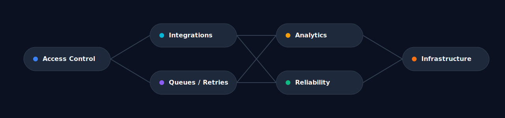

# Mykhailo Yarytskyi

**Senior Backend, Full-Stack, and Platform Engineer**

I build production-grade systems with a focus on backend architecture, integration boundaries, async workflows, data and reporting services, and operator-facing reliability tooling. This profile is organized around an eight-repository public portfolio that shows how I approach secure application delivery, service operations, and platform readiness.

[GitHub](https://github.com/mmmihaeel) | [LinkedIn](https://www.linkedin.com/in/mykhailo-yarytskyi-330aa0284/) | [Portfolio](https://mmmihaeel.webflow.io/) | [Email](mailto:mikael11032005@gmail.com)

## Quick Navigation

[Engineering Profile](#engineering-profile) | [Core Engineering Scope](#core-engineering-scope) | [Technology Focus](#technology-focus) | [Featured Repositories](#featured-repositories) | [Repository Navigation](#repository-navigation) | [Delivery Patterns](#delivery-patterns) | [Selected Professional Work](#selected-professional-work) | [Current Focus](#current-focus) | [Contact](#contact)

## Engineering Profile

I work best on systems that need more than straightforward CRUD. That includes permissioned workflows, auditability, webhook and event processing, queue-backed orchestration, analytics pipelines, and the operational interfaces needed to run services confidently.

Across the public repositories, the through-line is clear boundaries: secure APIs, integration handling, replay-safe async processing, SQL-first reporting, operational visibility, Linux and Docker fluency, and practical delivery environments that are built to be operated.

## Core Engineering Scope

| Scope | What It Looks Like |
| --- | --- |
| Backend systems | API-first services for business workflows, policy enforcement, access control, and audit-ready change tracking |
| System design | Clear service boundaries, ownership models, reliability concerns, and maintainable operational interfaces |
| Integrations | Webhook ingestion, normalization, idempotency, delivery tracking, retries, and external contract management |
| Async processing | Queues, workers, stateful orchestration, reminders, notifications, replay, and recovery paths |
| Data and reporting | SQL-heavy query design, aggregations, scheduled recomputation, cache control, and reporting endpoints |
| Ops tooling | Health and status models, retry controls, incident workflows, diagnostics, and operator-facing APIs |
| Platform and delivery | Dockerized environments, Linux operations, reverse proxies, CI/CD, and infrastructure automation labs |

## Technology Focus

| Area | Technologies |
| --- | --- |
| Backend and services | PHP, Laravel, Symfony, TypeScript/Node.js, NestJS, Go, Java, Spring Boot |
| Frontend surfaces | React, Next.js |
| Data and messaging | PostgreSQL, MySQL, Redis, RabbitMQ, SQL-first modeling, caching |
| Infrastructure and delivery | Docker, Docker Compose, Linux, Apache, Nginx, Kubernetes, Terraform, Ansible, GitHub Actions, Azure DevOps, LocalStack |
| Delivery style | REST APIs, WebSockets, validation and policy layers, testing, queue-backed workflows |

## Featured Repositories

The portfolio is intentionally broad but cohesive: secure backends, orchestration, integrations, realtime operations, analytics, monitoring, Linux infrastructure, and platform delivery.

| Repository | Primary Focus | Why It Matters | Stack |
| --- | --- | --- | --- |
| [deal-room-api](https://github.com/mmmihaeel/deal-room-api) | Secure deal-room backend | Shows permissioned document workflows, scoped sharing, and audit-ready backend design | PHP, Laravel, MySQL, Redis, Docker |
| [conference-orchestrator](https://github.com/mmmihaeel/conference-orchestrator) | Event and call workflow orchestration | Shows lifecycle control, participant coordination, and queue-backed workflow execution | PHP, Symfony, PostgreSQL, Redis, RabbitMQ, Docker |
| [integration-gateway](https://github.com/mmmihaeel/integration-gateway) | Webhook ingestion and integration processing | Shows clean integration boundaries, canonical event handling, idempotency, retries, and replay-friendly delivery | TypeScript, Node.js, PostgreSQL, Redis, RabbitMQ, Docker |
| [realtime-ops-platform](https://github.com/mmmihaeel/realtime-ops-platform) | Realtime operations microservices | Shows event-driven operational workflows, queue-backed processing, and realtime service updates | TypeScript, NestJS, PostgreSQL, Redis, RabbitMQ, WebSockets, Docker |
| [pg-analytics-service](https://github.com/mmmihaeel/pg-analytics-service) | Query-heavy analytics service | Shows SQL-first analytics design, scheduled recomputation, and predictable cache and version handling | Go, PostgreSQL, Redis, Docker |
| [ops-monitor](https://github.com/mmmihaeel/ops-monitor) | Operational monitoring and intervention API | Shows operator-facing reliability tooling with health checks, retry workflows, status models, and audit trails | Java, Spring Boot, PostgreSQL, Redis, Docker |
| [linux-infra-lab](https://github.com/mmmihaeel/linux-infra-lab) | Linux and infrastructure operations lab | Shows reverse proxying, automation scripts, backup and restore runbooks, and service diagnostics | Linux, Bash, Apache, Docker Compose, Node.js, PHP, MySQL, PostgreSQL, Redis |
| [platform-delivery-lab](https://github.com/mmmihaeel/platform-delivery-lab) | Platform delivery and DevOps lab | Shows infrastructure automation, CI/CD workflows, Kubernetes-style delivery, and local cloud-oriented platform tooling | Docker, Kubernetes, Terraform, Ansible, LocalStack, Apache, Nginx, GitHub Actions, Azure DevOps |

## Repository Navigation

1. [deal-room-api](https://github.com/mmmihaeel/deal-room-api) for permissioned backend workflows, document access boundaries, and auditability.
2. [conference-orchestrator](https://github.com/mmmihaeel/conference-orchestrator) for lifecycle orchestration, participant workflows, reminders, and queue-backed execution.
3. [integration-gateway](https://github.com/mmmihaeel/integration-gateway) for webhook ingestion, event normalization, idempotency, retries, and delivery tracking.
4. [realtime-ops-platform](https://github.com/mmmihaeel/realtime-ops-platform) for microservice coordination, alerts, notifications, and realtime operational visibility.
5. [pg-analytics-service](https://github.com/mmmihaeel/pg-analytics-service) for reporting flows, aggregation-heavy data work, and recomputation pipelines.
6. [ops-monitor](https://github.com/mmmihaeel/ops-monitor) for operational status modeling, failed-job intervention, and reliability-oriented APIs.
7. [linux-infra-lab](https://github.com/mmmihaeel/linux-infra-lab) for Linux service operations, reverse proxies, backups, and environment-level diagnostics.
8. [platform-delivery-lab](https://github.com/mmmihaeel/platform-delivery-lab) for delivery automation, infrastructure-as-code, Kubernetes workflows, and platform engineering breadth.

## Delivery Patterns

| Pattern | How It Shows Up |
| --- | --- |
| Access control and auditability | Scoped permissions, policy enforcement, audit logs, and traceable operator actions |
| Async workflows and recovery | Queues, workers, retries, replay paths, lifecycle orchestration, and failure visibility |
| Data and reporting systems | Aggregations, reporting endpoints, scheduled recomputation, SQL-first modeling, and cache discipline |
| Platform and delivery workflows | Docker, Linux, reverse proxies, CI/CD, infrastructure automation, and environments designed to be operated |

## Selected Professional Work

Public repositories are only one part of the profile. LinkedIn-backed experience also includes delivery in product, contract, and freelance environments where source code is not public.

- Full-stack product work with React and Next.js frontends backed by Node.js and PHP services
- API integrations and workflow automation across content, CRM, and business operations use cases
- SQL and NoSQL data work involving query tuning, caching, backend refactors, and reliability improvements
- CI/CD, containerized environments, release workflows, and AEM-based enterprise delivery involving component systems, dispatcher and cache concerns, and content operations

## Current Focus

- Backend architecture with explicit reliability, ownership, and operational clarity
- Async workflows with retries, replay, failure handling, and observable service behavior
- Integration-heavy systems with clean contracts between internal and external services
- Platform delivery practices spanning containers, Linux operations, and infrastructure automation

## Contact

- GitHub: [github.com/mmmihaeel](https://github.com/mmmihaeel)
- LinkedIn: [linkedin.com/in/mykhailo-yarytskyi-330aa0284](https://www.linkedin.com/in/mykhailo-yarytskyi-330aa0284/)
- Portfolio: [mmmihaeel.webflow.io](https://mmmihaeel.webflow.io/)
- Email: [mikael11032005@gmail.com](mailto:mikael11032005@gmail.com)
